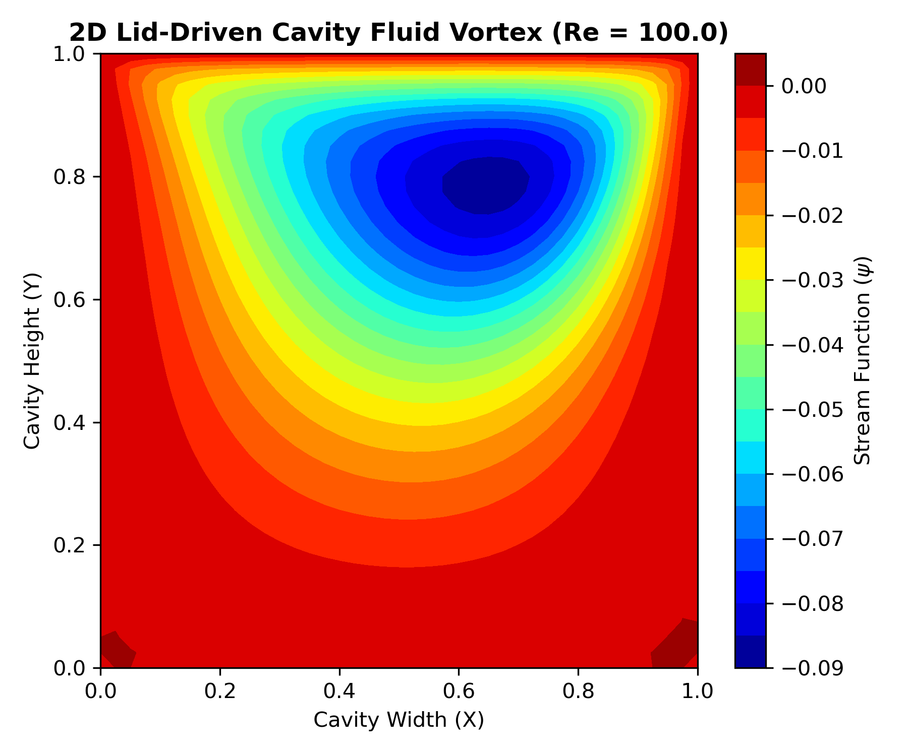

# 2D-Lid-Driven-Cavity-CFD
A 2D Lid-Driven Cavity Navier-Stokes fluid solver written from scratch in Python for CFD code validation.
# 2D Lid-Driven Cavity CFD Solver from Scratch

A Python-based Computational Fluid Dynamics (CFD) solver for the classic **2D Lid-Driven Cavity** benchmark problem. This project implements the **Stream Function-Vorticity ($\psi-\omega$) formulation** using finite difference numerical discretization.

## 🚀 Project Overview
The lid-driven cavity is an industry-standard benchmark used to test and validate incompressible Navier-Stokes solvers. The simulation models a square container filled with fluid where three walls remain perfectly static (no-slip condition), while the top wall (the lid) moves horizontally at a constant velocity $U$. This movement drags the fluid along, generating a dominant primary vortex at the center of the cavity.

### Key Technical Features
- **Mathematical Formulation:** Stream Function-Vorticity ($\psi-\omega$) equations to bypass direct pressure coupling.
- **Spatial Discretization:** Second-order Central Difference scheme on a structured collocated grid.
- **Temporal Discretization:** First-order explicit Forward Euler scheme.
- **Numerical Engines:** Written from scratch using `NumPy` for grid structures and `Matplotlib` for post-processed visuals.

---

## 📐 Governing Physics Equations

Instead of using primitive variables ($u, v, p$), this solver transforms the incompressible Navier-Stokes equations into two continuous operations:

1. **Vorticity Transport Equation:**
   $$\frac{\partial \omega}{\partial t} + u\frac{\partial \omega}{\partial x} + v\frac{\partial \omega}{\partial y} = \frac{1}{Re} \left( \frac{\partial^2 \omega}{\partial x^2} + \frac{\partial^2 \omega}{\partial y^2} \right)$$

2. **Stream Function Poisson Equation:**
   $$\frac{\partial^2 \psi}{\partial x^2} + \frac{\partial^2 \psi}{\partial y^2} = -\omega$$

Where directional velocity fields are computed from the stream function contours via:
$$u = \frac{\partial \psi}{\partial y}, \quad v = -\frac{\partial \psi}{\partial x}$$

---

## 📊 Simulated Results

### Fluid Vorticity Profile
The generated contour lines track the pathways of the fluid. The core of the vortex is clearly formed in the upper-right quadrant due to the convective momentum transfer from the moving lid.

